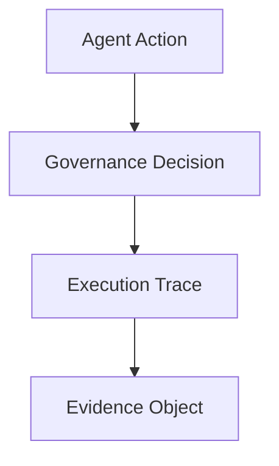

# Evidence Object Specification

## Overview

The ARO Audit Evidence Object is a portable audit artifact for AI runtime
actions. It captures the minimum record needed to reconstruct what the agent
did, what governance decision was applied, which tools were invoked, and how
the final result can be checked after execution.

## Motivation

Observability logs are not enough for governance review. External reviewers
need a bounded object that can move across systems without depending on the
original runtime. The Evidence Object provides that portable surface.

It is designed to support:

- post-run audit review
- evidence exchange between runtimes
- benchmark reproducibility
- governance conformance checks

## Evidence Object Structure



The Evidence Object contains exactly these top-level fields:

| Field | Type | Meaning |
| --- | --- | --- |
| `agent_id` | string | Identifier of the agent or runtime emitting evidence |
| `persona_id` | string | Persona or role identity attached to the run |
| `interaction_trace` | array<object> | Ordered interaction record for the run |
| `policy_decisions` | array<object> | Allow, deny, flag, or degrade decisions taken during governance |
| `execution_hash` | string | SHA-256 hash over trace, policy decisions, tool calls, and result summary |
| `timestamp` | string | ISO 8601 timestamp for evidence creation |
| `tool_calls` | array<object> | Tool invocation record for the run |
| `result_summary` | string | Portable summary of the bounded outcome |

## Schema Definition

The canonical schema is:

- `schema/evidence.schema.json`

The schema declares:

- required fields
- JSON types
- SHA-256 hash format for `execution_hash`
- date-time format for `timestamp`
- no extra top-level fields

The schema and the implementation validator are intentionally aligned. Any
consumer that wants a machine-readable definition should use the schema file as
the first source of truth.

## Validation Rules

The reference validator is:

- `validator.py`

The validator applies these rules:

1. All required top-level fields must exist.
2. `agent_id`, `persona_id`, and `result_summary` must be non-empty strings.
3. `interaction_trace`, `policy_decisions`, and `tool_calls` must be arrays.
4. `timestamp` must be a valid ISO 8601 datetime string.
5. `execution_hash` must be a 64-character lowercase SHA-256 hex digest.
6. Any `persona_id` embedded in `interaction_trace` must match the top-level `persona_id`.
7. `execution_hash` must match the canonical hash recomputed from:
   - `interaction_trace`
   - `policy_decisions`
   - `tool_calls`
   - `result_summary`

Validation examples:

```bash
python validator.py examples/minimal_evidence.json
python validator.py examples/invalid_missing_field.json
```

## Example Objects

Reference examples:

- Valid minimal example: `examples/minimal_evidence.json`
- Invalid example: `examples/invalid_missing_field.json`

The valid example demonstrates the smallest portable object that still allows:

- identity review
- governance review
- tool-call review
- result verification

The invalid example demonstrates a broken object that fails validation because
the `execution_hash` field is missing.
